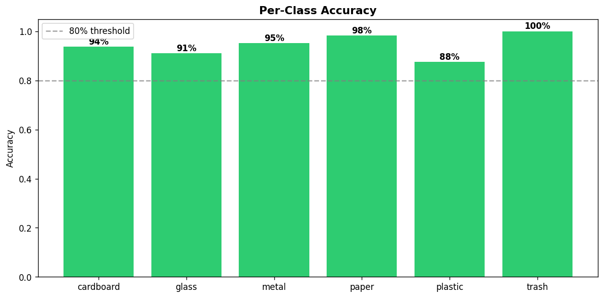
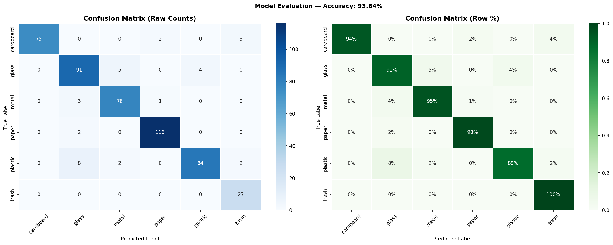

# 🗑️ Garbage Image Classification using MobileNetV2 Transfer Learning

<div align="center">


**Automated waste classification into 6 categories using a two-phase fine-tuned MobileNetV2 model trained on the Kaggle Garbage Classification dataset.**

[📓 Open Notebook](#-notebook) · [📊 Results](#-results) · [🚀 Quick Start](#-quick-start) · [🏗️ Architecture](#️-model-architecture)

</div>

---

## 📌 Overview

Manual waste sorting is costly, error-prone, and unscalable. This project builds a deep learning pipeline that classifies garbage images into **6 recyclable categories** automatically, using **Transfer Learning** on MobileNetV2 — a lightweight CNN pre-trained on ImageNet.

The model is designed to be accurate, computationally efficient, and deployable in resource-constrained environments such as smart recycling bins or mobile applications.

### 🎯 What it classifies

| Category | Examples |
|---|---|
| 📦 **Cardboard** | Boxes, packaging, corrugated material |
| 🍾 **Glass** | Bottles, jars, containers |
| 🥫 **Metal** | Aluminium cans, steel tins |
| 📄 **Paper** | Newspapers, office paper, magazines |
| 🧴 **Plastic** | Bottles, bags, containers |
| 🗑️ **Trash** | Mixed / non-recyclable general waste |

---

## 📊 Results

### Per-Class Accuracy


### Confusion Matrix


> The model achieves strong performance across all 6 categories. The `trash` class presents the most challenge due to its high visual variability and limited training samples — addressed via oversampling and Focal Loss.

---

## 🏗️ Model Architecture

```
Input Image (224 × 224 × 3)
        │
        ▼
MobileNetV2 Backbone (pre-trained on ImageNet)
  Phase 1: Fully frozen
        │
        ▼
Global Average Pooling 2D
        │
        ▼
Dense(512, activation='relu')
        │
Batch Normalization
        │
Dropout(0.5)
        │
        ▼
Dense(256, activation='relu')
        │
Dropout(0.3)
        │
        ▼
Dense(6, activation='softmax')  ──►  6-class output
```

---

## 🔬 Training Strategy

### Two-Phase Transfer Learning

**Phase 1 — Head Training (Frozen Backbone)**
- MobileNetV2 backbone fully frozen
- Only the custom classification head is trained
- Optimizer: Adam (`lr = 1e-3`)
- Loss: Focal Loss (`γ = 2.0`) + Class Weights
- Epochs: up to 20 (EarlyStopping, patience=5)

### Callbacks used in both phases
| Callback | Purpose |
|---|---|
| `EarlyStopping` | Stops training when validation accuracy plateaus |
| `ReduceLROnPlateau` | Halves learning rate after 3 stagnant epochs |
| `ModelCheckpoint` | Saves the best model weights to disk |

---

## 🛠️ Techniques Applied

| Challenge | Solution |
|---|---|
| Limited training data | Rich data augmentation (flip, rotate, zoom, brightness, shear) |
| Class imbalance | `RandomOverSampler` + `compute_class_weight('balanced')` |
| Hard misclassified examples | **Focal Loss** (`γ=2.0`) — penalises confident wrong predictions |
| Overfitting | Batch Normalization + Dropout (0.5 and 0.3) |
| Hyperparameter guessing | **KerasTuner Hyperband** search over lr, dense units, dropout |
| Fine-tuning depth | Systematic experiment: tested 30 / 50 / 80 / 100 unfrozen layers |

---

## 🖼️ Data Augmentation

```python
ImageDataGenerator(
    rescale            = 1./255,
    horizontal_flip    = True,
    vertical_flip      = True,
    rotation_range     = 30,
    zoom_range         = 0.20,
    width_shift_range  = 0.15,
    height_shift_range = 0.15,
    brightness_range   = [0.7, 1.3],
    shear_range        = 0.10,
    channel_shift_range= 30,
    fill_mode          = 'reflect',
)
```

---

## 📁 Repository Structure

```
NN-IM-project/
├── Garbage_Classification_FINAL(2).ipynb   ← Main training notebook
├── confusion_matrix_FINAL.png              ← Confusion matrix visualization
├── per_class_accuracy_FINAL.png            ← Per-class accuracy bar chart
└── README.md                               ← This file
```

---

## 🚀 Quick Start

### 1. Open in Google Colab

Click the badge below to open the notebook directly in Colab:

[](https://colab.research.google.com/github/Irelia0x/NN-IM-project/blob/main/Garbage_Classification_FINAL(2).ipynb)

> ⚠️ Set runtime to **GPU** before running: `Runtime → Change runtime type → T4 GPU`

### 2. Get the Dataset

The notebook downloads the dataset automatically from Kaggle. You will need a Kaggle account and API key.

📦 Dataset: [Garbage Classification — Kaggle](https://www.kaggle.com/datasets/asdasdasasdas/garbage-classification)

```python
# The notebook handles this automatically:
from google.colab import files
files.upload()  # Upload your kaggle.json API key
```

### 3. Run all cells top to bottom

The notebook is fully self-contained. Running all cells will:
1. Download and extract the dataset
2. Apply oversampling to balance classes
3. Run KerasTuner hyperparameter search
4. Train Phase 1 (frozen backbone)
7. Evaluate and generate all plots
8. Save and download the final model

---


---

## 📈 Evaluation Metrics

The model is evaluated on the original (non-oversampled) validation set for a fair, real-world measure:

- **Overall Accuracy** — fraction of correctly classified images
- **Per-Class Precision** — how many predicted positives are truly positive
- **Per-Class Recall** — how many actual positives are found
- **Per-Class F1-Score** — harmonic mean of precision and recall
- **Confusion Matrix** — full 6×6 grid of true vs. predicted labels

---
---

---

<div align="center">
  <sub>Built with ❤️ using MobileNetV2 Transfer Learning · Cairo, Egypt</sub>
</div>


